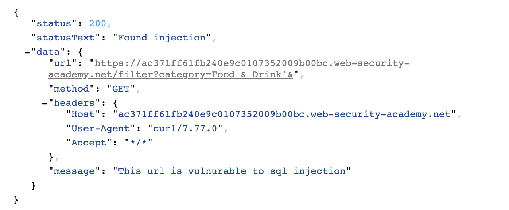
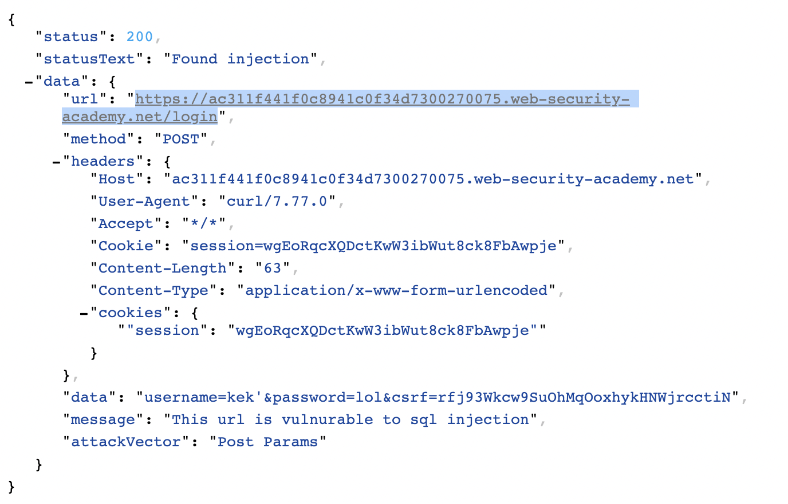

Задание 3

Само задание можно прочитать в файле task.md

Так как используются самоподписанные ключи, чтобы curl не ругался необходимо использовать флаг -k пример:
`curl -k -x http://127.0.0.1:8080 https://mail.ru/`

Сборка докер-контейнера:
`docker build . -t proxy`

Запуск контейнера на 8080 порту:
`docker run -p 8080:8080 -p 8081:8081 -t proxy`

Запросы для api

get `http://localhost:8081/requests` - получить из базы все запросы и ответы  
get `http://localhost:8081/request/:id` - получить из базы запрос id и ответ на него  
get `http://localhost:8081/repeat/:id` - повторить запрос id
get `http://localhost:8081/inject/:id` - проверить запрос на уязвимость к sql инъекции

Пример уязвимости:
Первая лабораторная работа в port swigger academy.
https://portswigger.net/web-security/sql-injection/lab-retrieve-hidden-data

Вторая лабораторная работа
https://portswigger.net/web-security/sql-injection/lab-login-bypass

Для запуска без контейнера нужно сгенерить ключи 
`sh gen_ca.crt`
И установить зависимости 
`npm install`# tp-security-4
